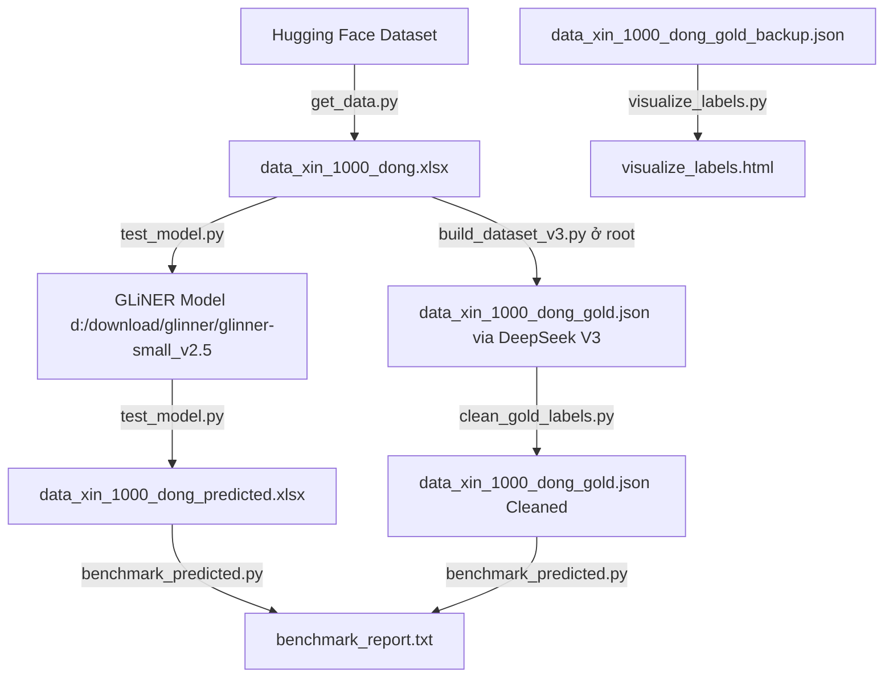

# Tài liệu thư mục `data_test`

Thư mục này chứa dữ liệu kiểm thử và các kịch bản (scripts) liên quan đến việc thu thập dữ liệu, chạy dự đoán mô hình (inference) và phân tích đối chiếu kết quả NER.

---

## Danh sách tệp tin và mô tả chi tiết

### 1. [get_data.py](file:///d:/dfghtraingliner/data_test/get_data.py)
Script này dùng để tải dữ liệu từ Hugging Face và tạo file Excel phục vụ cho việc kiểm thử.

- **Các thư viện liên kết**: `pandas`, `datasets` (Hugging Face)
- **Hàm/Logic chính**:
  - Không định nghĩa hàm riêng mà chạy trực tiếp dưới dạng script:
    - **Tải dataset**: Sử dụng `load_dataset("tinixai/vietnamese-job-descriptions", split="train")` để lấy tập dữ liệu mô tả công việc tiếng Việt.
    - **Nối dữ liệu (CONCAT_WS)**: Nối 5 cột (`job_title`, `experience_level`, `job_position`, `job_description`, `requirements`) lại với nhau bằng 2 dấu cách để tạo thành văn bản hoàn chỉnh trong cột `combined_text`.
    - **Lấy ngẫu nhiên (LIMIT 1000)**: Trộn ngẫu nhiên (shuffle) với seed 42 và chọn ra 1000 bản ghi đầu tiên.
    - **Xuất dữ liệu**: Xuất kết quả ra file Excel mặc định là `vietnamese_jobs_combined_1k.xlsx`.

---

### 2. [test_model.py](file:///d:/dfghtraingliner/data_test/test_model.py)
Script dùng để chạy mô hình GLiNER NER đã huấn luyện trên file Excel kiểm thử, nhằm trích xuất thông tin `SKILL` và `EXPERIENCE`.

- **Các thư viện liên kết**: `pandas`, `gliner`, `tqdm`, và module `utils` ở thư mục cha.
- **Hàm/Logic chính**:
  - **`main()`**: Hàm điều phối luồng chính:
    - Tích hợp `argparse` hỗ trợ các cờ lệnh ghi đè: `--model_path` (đường dẫn mô hình), `--excel_in` (Excel đầu vào), `--excel_out` (Excel đầu ra), và `--threshold` (ngưỡng dự đoán).
    - Giải quyết các đường dẫn mặc định động bằng thư viện `pathlib` tương thích chéo nền tảng (Windows/Kaggle Linux), tự động tìm mô hình tại `outputs/gliner/final_model` và các file dữ liệu trong thư mục `data_test`.
    - Kiểm tra và cấu hình thiết bị phần cứng (GPU/CPU) bằng cách liên kết với hàm `check_device()` của [utils.py](file:///c:/Users/loiha/Videos/dfghtraingliner/utils.py).
    - Tải mô hình GLiNER từ thư mục mô hình đã chỉ định.
    - Tự động đọc danh sách nhãn thực thể từ `entity_types.json` trong thư mục mô hình.
    - Đọc file dữ liệu kiểm thử Excel.
    - Chạy dự đoán thực thể dạng vòng lặp từng câu sử dụng `model.predict_entities` được tối ưu hóa trong khối `with torch.no_grad()` để đảm bảo tính ổn định và kiểm soát dung lượng bộ nhớ RAM/VRAM.
    - Phân tích và lọc trùng các thực thể tìm được (tách riêng cột `predicted_skills` và `predicted_experience` dạng chuỗi ngăn cách bởi dấu phẩy, và lưu JSON gốc vào cột `predicted_entities_raw_json`).
    - Lưu DataFrame kết quả vào file Excel mới.
    - In bảng thống kê chi tiết kết quả chạy thử nghiệm.

---

### 3. [benchmark_predicted.py](file:///d:/dfghtraingliner/data_test/benchmark_predicted.py)
Script dùng để so sánh, đối chiếu kết quả trích xuất thực thể của GLiNER với nhãn chuẩn của DeepSeek V3 bằng hai phương pháp: Exact Match (khớp chính xác) và Overlap Match (khớp giao nhau).

- **Các thư viện liên kết**: `pandas`, `json`.
- **Hàm/Logic chính**:
  - **`calculate_metrics(tp, fp, fn)`**: Hàm phụ tính toán các chỉ số Precision, Recall và F1-score từ các thống kê cơ bản.
  - **`overlaps(s1, s2)`**: Hàm xác định hai thực thể có cùng nhãn và có giao nhau (chồng lớp ít nhất 1 ký tự) hay không.
  - **`main()`**: Hàm điều phối chính:
    - Cấu hình output UTF-8 để chạy mượt mà trên console Windows mà không bị lỗi mã hóa tiếng Việt.
    - Đọc tập nhãn chuẩn `data_xin_1000_dong_gold.json` (sinh ra bởi [build_dataset_v3.py](file:///c:/Users/loiha/Videos/dfghtraingliner/build_dataset_v3.py) từ thư mục gốc).
    - Đọc file Excel kết quả dự đoán `data_xin_1000_dong_predicted.xlsx` (sinh ra bởi `test_model.py`).
    - Tính toán TP, FP, FN cho cả hai chế độ: **Exact Match** (so khớp chính xác offset) và **Overlap Match** (so khớp giao nhau ký tự). Tích hợp logic tự động lọc bỏ các dự đoán SKILL từ mô hình bị chồng lấn với nhãn chuẩn MAJOR trong tập Gold, đồng thời tự động áp dụng ngưỡng động tối ưu (SKILL >= 0.80, EXPERIENCE >= 0.50) để nâng cao đáng kể chỉ số F1-Score.
    - In kết quả đối chiếu ra terminal và lưu báo cáo chi tiết kèm phân tích sai lệch vào file [benchmark_report.txt](file:///c:/Users/loiha/Videos/dfghtraingliner/data_test/benchmark_report.txt).

---

### 4. [clean_gold_labels.py](file:///d:/dfghtraingliner/data_test/clean_gold_labels.py)
Script này dùng để làm sạch và giải quyết chồng lấn nhãn trong tập nhãn vàng DeepSeek V3 (`data_xin_1000_dong_gold.json`).

- **Các thư viện liên kết**: `shutil`, `json`, `re`.
- **Hàm/Logic chính**:
  - Tự động sao lưu file nhãn vàng gốc thành `data_xin_1000_dong_gold_backup.json` (chỉ sao lưu một lần duy nhất).
  - Loại bỏ các từ mơ hồ (Blacklist) khỏi nhãn `SKILL`.
  - Loại bỏ các vị trí công việc (như *developer*, *engineer*) bị gán nhầm làm `SKILL`.
  - Sắp xếp và giải quyết chồng lấn nhãn (chỉ giữ lại nhãn dài hơn).
  - Ghi đè kết quả đã làm sạch trực tiếp lên file `data_xin_1000_dong_gold.json` phục vụ đối chiếu benchmark.

---

### 5. [visualize_labels.py](file:///d:/dfghtraingliner/data_test/visualize_labels.py)
Script này dùng để tạo giao diện trực quan hóa nhãn vàng đã gán dưới dạng trang web HTML tương tác đầy đủ, cho phép lọc theo loại thực thể, cấp bậc công việc (Level), và tìm kiếm văn bản.

- **Các thư viện liên kết**: `json`, `html`, `os`.
- **Hàm/Logic chính**:
  - **`highlight_text(text, labels)`**: Lọc, sắp xếp và giải quyết chồng chéo các nhãn thực thể, sau đó bọc các span từ nhãn bằng thẻ HTML với các CSS Class thích hợp (`skill`, `experience`, `major`) để làm nổi bật.
  - **`main()`**: Đọc dữ liệu từ `data_xin_1000_dong_gold_backup.json`, tiền xử lý, tính toán thống kê tổng số thực thể và phân phối các loại nhãn, sau đó ghi toàn bộ dữ liệu này và mã giao diện HTML/JS vào file [visualize_labels.html](file:///d:/dfghtraingliner/data_test/visualize_labels.html).

---

## Mối liên kết giữa các tệp tin và luồng xử lý

1. **`get_data.py`** tạo ra file dữ liệu mẫu dạng Excel `data_xin_1000_dong.xlsx`.
2. **`test_model.py`** nhận `data_xin_1000_dong.xlsx` làm đầu vào, gọi mô hình GLiNER để dự đoán và xuất ra file kết quả `data_xin_1000_dong_predicted.xlsx`.
3. **`build_dataset_v3.py`** (nằm ở thư mục root) sử dụng DeepSeek V3 API để gán nhãn chuẩn từ file Excel `data_xin_1000_dong.xlsx`, xuất ra file JSON nhãn chuẩn `data_xin_1000_dong_gold.json`.
4. **`clean_gold_labels.py`** làm sạch và giải quyết chồng lấn trong file nhãn vàng `data_xin_1000_dong_gold.json`.
5. **`benchmark_predicted.py`** đối chiếu kết quả dự đoán trong file Excel `data_xin_1000_dong_predicted.xlsx` với nhãn chuẩn đã làm sạch trong file JSON `data_xin_1000_dong_gold.json`, tính toán độ chính xác và xuất báo cáo `benchmark_report.txt`.
6. **`visualize_labels.py`** đọc dữ liệu từ `data_xin_1000_dong_gold_backup.json` và tạo ra trang trực quan hóa tương tác `visualize_labels.html`.
