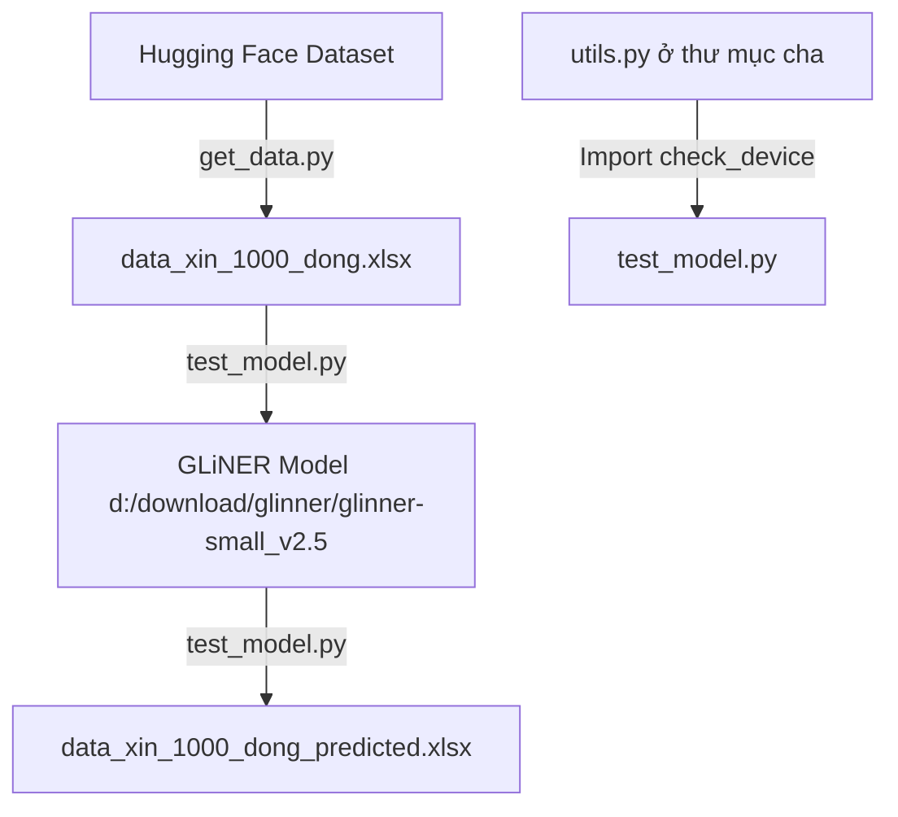

# Tài liệu thư mục `data_test`

Thư mục này chứa dữ liệu kiểm thử và các kịch bản (scripts) liên quan đến việc thu thập dữ liệu, chạy dự đoán mô hình (inference) và phân tích kết quả NER.

---

## Danh sách tệp tin và mô tả chi tiết

### 1. [get_data.py](file:///c:/Users/loiha/Videos/dfghtraingliner/data_test/get_data.py)
Script này dùng để tải dữ liệu từ Hugging Face và tạo file Excel phục vụ cho việc kiểm thử.

- **Các thư viện liên kết**: `pandas`, `datasets` (Hugging Face)
- **Hàm/Logic chính**:
  - Không định nghĩa hàm riêng mà chạy trực tiếp dưới dạng script script-style:
    - **Tải dataset**: Sử dụng `load_dataset("tinixai/vietnamese-job-descriptions", split="train")` để lấy tập dữ liệu mô tả công việc tiếng Việt.
    - **Nối dữ liệu (CONCAT_WS)**: Nối 5 cột (`job_title`, `experience_level`, `job_position`, `job_description`, `requirements`) lại với nhau bằng 2 dấu cách để tạo thành văn bản hoàn chỉnh trong cột `combined_text`.
    - **Lấy ngẫu nhiên (LIMIT 1000)**: Trộn ngẫu nhiên (shuffle) với seed 42 và chọn ra 1000 bản ghi đầu tiên.
    - **Xuất dữ liệu**: Xuất kết quả ra file Excel mặc định là `vietnamese_jobs_combined_1k.xlsx`.

---

### 2. [test_model.py](file:///c:/Users/loiha/Videos/dfghtraingliner/data_test/test_model.py)
Script dùng để chạy mô hình GLiNER NER đã huấn luyện trên file Excel kiểm thử, nhằm trích xuất thông tin `SKILL` và `EXPERIENCE`.

- **Các thư viện liên kết**: `pandas`, `gliner`, `tqdm`, và module `utils` ở thư mục cha.
- **Hàm/Logic chính**:
  - **`main()`**: Hàm điều phối luồng chính:
    - Kiểm tra và cấu hình thiết bị phần cứng (GPU/CPU) bằng cách liên kết với hàm `check_device()` của [utils.py](file:///c:/Users/loiha/Videos/dfghtraingliner/utils.py).
    - Tải mô hình GLiNER từ thư mục mô hình cục bộ `d:\download\glinner\glinner-small_v2.5`.
    - Tự động đọc danh sách nhãn thực thể từ `entity_types.json` trong thư mục mô hình.
    - Đọc file dữ liệu kiểm thử `data_xin_1000_dong.xlsx`.
    - Chạy dự đoán thực thể dạng vòng lặp từng câu sử dụng `model.predict_entities` được tối ưu hóa trong khối `with torch.no_grad()` để đảm bảo tính ổn định và kiểm soát dung lượng bộ nhớ RAM/VRAM.
    - Phân tích và lọc trùng các thực thể tìm được (tách riêng cột `predicted_skills` và `predicted_experience` dạng chuỗi ngăn cách bởi dấu phẩy, và lưu JSON gốc vào cột `predicted_entities_raw_json`).
    - Lưu DataFrame kết quả vào file Excel mới: `data_xin_1000_dong_predicted.xlsx`.
    - In bảng thống kê chi tiết kết quả chạy thử nghiệm.

---

## Mối liên kết giữa các tệp tin trong thư mục

1. **`get_data.py`** tạo ra file dữ liệu mẫu dạng Excel (tương tự hoặc chính là file `data_xin_1000_dong.xlsx` được cung cấp).
2. **`test_model.py`** nhận `data_xin_1000_dong.xlsx` làm đầu vào, gọi mô hình GLiNER đã huấn luyện tại đường dẫn `d:\download\glinner\glinner-small_v2.5`, thực hiện trích xuất thực thể, rồi xuất ra file kết quả `data_xin_1000_dong_predicted.xlsx`.
3. **`test_model.py`** tái sử dụng các hàm tiện ích như `check_device` và `print_banner` từ module [utils.py](file:///c:/Users/loiha/Videos/dfghtraingliner/utils.py) ở thư mục cha để đảm bảo tính đồng bộ của dự án.
